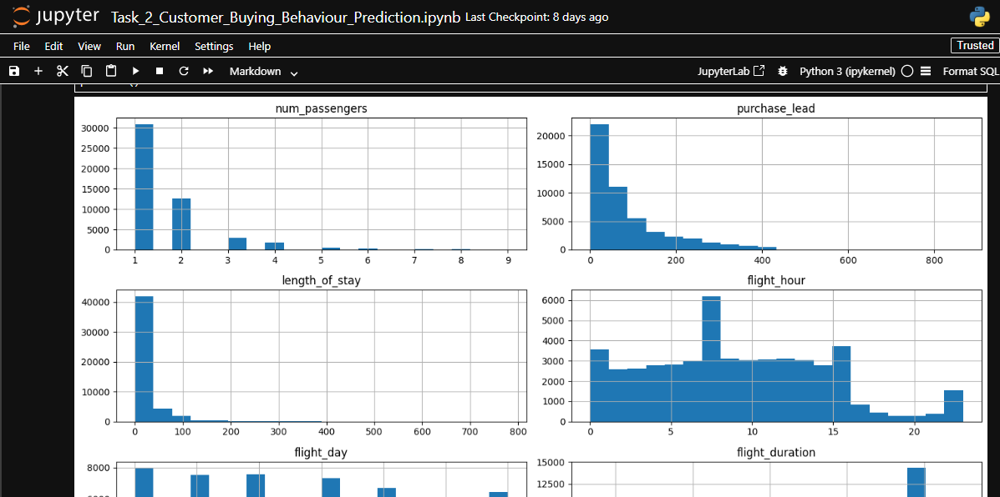
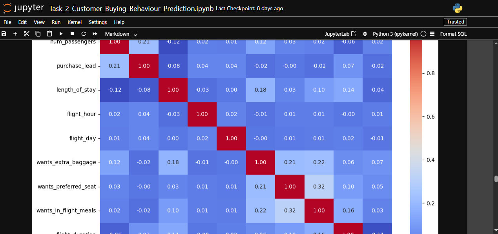
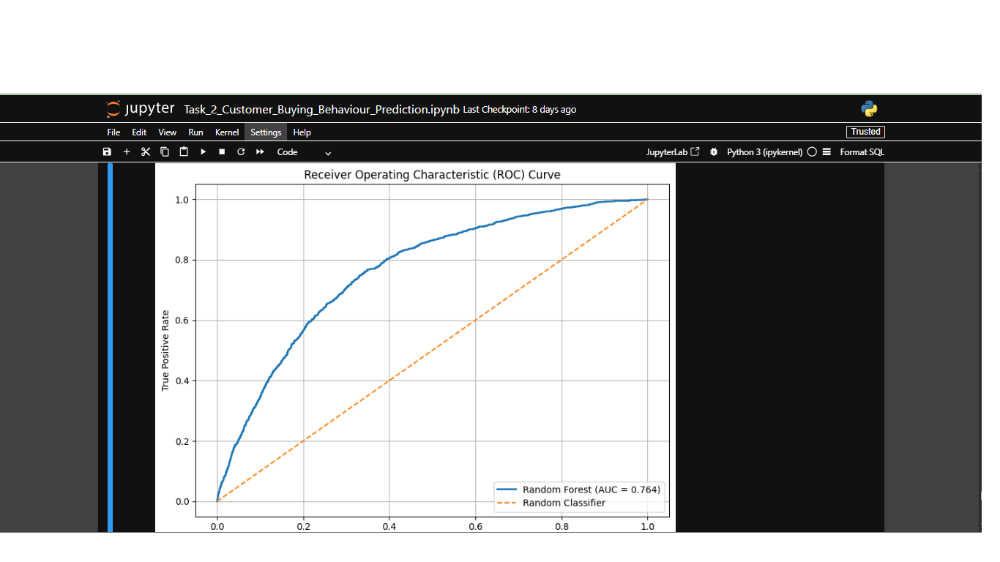

# 🤖 Task 2: Predicting Customer Buying Behaviour

## Model Overview

This project was completed as part of the **British Airways Data Science Job Simulation** on Forage.

The objective was to develop a machine learning model capable of predicting whether a customer would complete a holiday booking based on their booking details and travel preferences. The insights generated from the model can help British Airways identify customers with a high likelihood of booking and support more targeted marketing strategies.

---

## Business Problem

British Airways receives thousands of flight searches and bookings every day. However, not every customer who begins the booking process completes a purchase.

Understanding the factors that influence booking completion enables the airline to:

- Improve customer targeting
- Increase booking conversion rates
- Optimize marketing campaigns
- Personalize customer offers
- Improve revenue generation

The goal of this project was to build a predictive model that estimates the probability of booking completion using historical customer booking data.

---

## Dataset

The dataset contains historical customer booking information, including travel details and booking behaviour.

Key features include:

- Number of passengers
- Purchase lead time
- Flight duration
- Flight day
- Sales channel
- Trip type
- Route
- Booking origin
- Additional services purchased
- Booking completion (Target Variable)

---

## Project Workflow

### 1. Data Exploration

Performed an initial assessment of the dataset by:

- Inspecting data types
- Identifying missing values
- Checking for duplicate records
- Exploring the distribution of numerical and categorical variables

---

### 2. Data Cleaning

The dataset was prepared for modelling through:

- Removing duplicate records
- Encoding categorical variables
- Handling missing values
- Creating model-ready features

---

### 3. Exploratory Data Analysis (EDA)

Exploratory analysis was conducted to understand customer booking behaviour and identify important trends.

Visualizations included:

- Booking completion distribution
- Correlation heatmap
- Feature distributions
- Categorical feature analysis

### Booking Completion Distribution



This visualization shows the distribution of completed and incomplete bookings, highlighting the class imbalance within the dataset.

---

### Correlation Heatmap



The correlation heatmap illustrates the relationships between numerical variables, helping identify patterns and potential multicollinearity before model training.

---


### 4. Feature Engineering

The dataset was transformed into a machine-learning-ready format by:

- Encoding categorical variables
- Selecting relevant predictive features
- Splitting data into training and testing sets

---

### 5. Machine Learning Model

A **Random Forest Classifier** was trained to predict booking completion.

The model was further improved using GridSearchCV, which systematically evaluated different combinations of hyperparameters to identify the configuration that produced the best predictive performance.

---

## Model Evaluation

The model was evaluated using multiple performance metrics, including:

- Accuracy
- Precision
- Recall
- F1-Score
- ROC-AUC Score
- Confusion Matrix

Performance visualizations include:

- ROC Curve
- Feature Importance

### Feature Importance


The feature importance chart highlights the variables that contributed most to predicting booking completion, providing valuable business insights into customer purchasing behaviour.

---

### ROC Curve



The ROC curve evaluates the model's ability to distinguish between customers who completed a booking and those who did not. A higher Area Under the Curve (AUC) indicates stronger predictive performance.
---

## Key Insights

The analysis identified several important predictors of booking completion.

Some of the most influential features included:

- Booking origin
- Purchase lead time
- Flight duration
- Sales channel
- Additional travel services

These insights provide valuable information for improving customer acquisition and conversion strategies.

---

## Business Recommendations

Based on the findings, British Airways could:

- Target customers with a high predicted booking probability.
- Personalize marketing campaigns based on customer characteristics.
- Encourage ancillary purchases through tailored offers.
- Improve digital booking experiences across different sales channels.
- Use predictive modelling to support future marketing and revenue planning.

---

## Technologies Used

- Python
- Pandas
- NumPy
- Scikit-learn
- Matplotlib
- Jupyter Notebook

---

## Repository Contents

```
Task_2_Customer_Buying_Behaviour/
├── README.md
├── BA_Customer_Buying_Behaviour_Prediction.ipynb
└── images/
    ├── booking_completion_distribution.png
    ├── correlation_heatmap.png
    ├── feature_importance_chart.png
    └── roc_curve.png
```

---

## Skills Demonstrated

- Data Cleaning
- Exploratory Data Analysis
- Feature Engineering
- Machine Learning
- Model Evaluation
- Predictive Analytics
- Business Insight Generation
- Python Programming

---

## Acknowledgements

This project was completed as part of the **British Airways Data Science Job Simulation** hosted on **Forage**.
